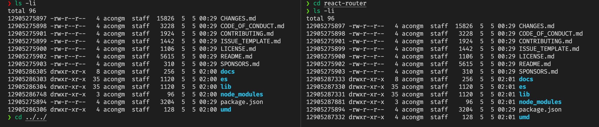

# 现代包管理器 - 从npm、yarn到pnpm
## javascript 包管理的历史

- npm 出现之前：前端依赖项是保存到存储库中并手动下载的 📁
- 2010：npm 发布并支持 nodejs📦
- 2012：npm 的使用量急剧增加——主要是由于 Browserifys 浏览器的支持 🎉
- 2012：npm 有了一个竞争对手 bower，它完全支持浏览器 💻
- 2012-2016：前端项目的依赖项数量成倍增加 🤯
- 2012-2016：构建和安装前端应用变得越来越慢 🐢
- 2012-2016：大量（重复的）依赖项存储在神奇的 node_modules 内的嵌套文件夹中 ☢️
- 2012-2016：rm -rf node_modules 成为前端开发人员最常用的命令。 🗑
- 2015：bower 输给了 npm 💀
- 2015：node_modules 被修改为扁平化的文件结构！ 🕸
- 2016： left-pad 成为当时的新闻头条 👈
- 2016： yarn 发布 🚀
  - 支持 npm 和 bower 仓库
  - yarn.lock 能够锁定安装的版本并提供确定性的依赖关系。不再 rm -rf - node_modules！
  - yarn install 花费的时间是 npm install 的一半（不使用缓存的前提下）
  - 缓存和脱机模式使构建过程几乎不花费时间
- 2016：npm 发布 shrinkwrap🧯
  - 尝试处理依赖项锁定
  - 不幸的是，一些错误和超出其管理能力的承诺导致该工具的声誉下降
- 2017：npm 5 发布 🔓
  - package-lock.json 是他们的新工具，shrinkwrap 被放在一边
  - package-lock.json 开始与 yarns 锁定文件竞争
- 2018：npm ci 发布 🛬
  - 直接用 package-lock.json 构建代码
  - 没有代价高昂的依赖项安全性分析和版本分析
  - 大大减少了在构建服务器上的构建时间！
- 2018：npm 6 发布 👮‍♀️
  - npm 检查要安装的依赖项中的安全漏洞
  - yarn 和 npm 的构建时间不再有显差异
- ...

## npm/yarn 回顾

### npm v2

在最早期的`npm`版本(npm v2)，`npm`的设计可以说是非常的简单,在安装依赖的时候会将依赖放到` node_modules`文件中; 随着项目的不断增大，依赖逐渐变成一个巨大的依赖树，不同依赖之间重复的依赖包也会重复安装，既占用我们电脑内存，也在安装/删除的过程中变得极为缓慢， 形成`嵌套地狱`

> 比如你安装一个 express，那么你会在 node_modules 下面只找到一个 express 的文件夹。而 express 依赖的项目都放在其文件夹下。

```
- app/
  - package.json
  - node_modules/
    - express/
      - index.js
      - package.json
      - node_modules/
        - ...
```

这个带来的问题或许 windows 用户深谙其痛，因为在这种安装环境下，会导致目录的层级特别高，而对于 windows 来说，最大的路径长度限制在 248 个字符(更多请见此)，再加上 node_modules 这个单词又特别长，

### npm v3

为了解决这些问题，(npm v3)重新考虑了 node_modules 结构并提出了扁平化。可以说很好的解决了嵌套层级过深以及实例不共享的问题。
所有的依赖都被拍平到`node_modules`目录下，不再有很深层次的嵌套关系。这样在安装新的包时，根据 node require 机制，会不停往上级的`node_modules`当中去找，如果找到相同版本的包就不会重新安装，解决了大量包重复安装的问题，而且依赖层级也不会太深。

```
- app/
- node_modules/
  - express/
  - connect/
  - path-to-regexp/
  - ...
```

如果出现了不同版本的依赖，比如说 package-a 依赖 `package-c@0.x.x的版本，而package-b依赖package-c@1.x.x` 版本，那么解决方案还是像之前的那种嵌套模式一样。

```
- app/
- node_modules/
  - package-a/
  - package-c/
    - // 0.x.x
  - package-b/
    - node_modules/
      - package-c/
        - // 1.x.x
```

但是， 扁平化的方式依然存在诸多问题...

### yarn v1

随着 node 社区壮大, 为了解决 npm 的几个问题

- 无法保证两次安装的版本是完全相同的。
- 安装速度慢。
- npm 是不支持离线模式,导致内网困难

所以，此时 yarn 诞生了，为的就是解决上面几个问题。

- 引入 `yarn.lock` 文件来管理依赖版本问题，保证每次安装都是一致的。
- 缓存加并行下载保证了安装速度

### npm v5

可能是受`yarn`的影响, npm v5 引入了 `package-lock.json` 来锁定版本, 且自动添加. 并且提升了安装速度, 但依然没有 yarn 快

### npm v6

加入了缓存, 进一步提升了速度

### yarn v2

2020 年发布的 yarn v2 可谓是 yarn 的一个巨大的改变
增加[Plug'n'Play](https://link.zhihu.com/?target=https%3A//next.yarnpkg.com/features/pnp)能力，作为重头戏，现在已经直接内置在 2.0 版本里面了。官方说可以用 node-modules 插件切换，但看起来并不能……

在使用 yarn 2.x 安装以后，node_modules 不会再出现，代替它的是.yarn 目录，里面有 cache 和 unplugged 两个目录，以及外面一个.pnp.js

- .yarn/cache 里面放所有需要的依赖的压缩包，zip 格式
- .yarn/unplugged 是你需要手动去修改的依赖，使用 yarn unplugin lodash 可以把 lodash 解压到这个目录下，之后想修改什么的随意
- .[pnp.js](https://www.zhihu.com/search?q=pnp.js&search_source=Entity&hybrid_search_source=Entity&hybrid_search_extra=%7B%22sourceType%22%3A%22answer%22%2C%22sourceId%22%3A986919691%7D)是 PNP 功能的核心，所有的依赖定位都需要通过它来

### 为什么会有`package-lock.json`、`yarn.lock` 的出现

在`package.json `中, 我们新增一个包都是使用 `^` 或者 `~` 的方式来安装依赖.
1、如果在不同的时间安装这些软件包，则可能会导致下载这些软件包的不同版本。
2、在删除了 `node_modules` 文件夹后, 不实用 `lock`  文件安装的情况下, 每次安装的依赖都不一样
3、在项目的依赖中, 某个依赖由于使用 `^` 方式, 将会安装最新的小版本, 这将可能影响到项目, 比如 `element-ui@2.12.0` 与之后的版本的 `Transfer 穿梭框` 组件样式就完全不一样等

因此，有`package-lock.json`、`yarn.lock` 的出现,将项目依赖每次新增以及修改的过程中, 将关系记录固定.就解决了这些问题.
但是, 千万不要混用 `npm` 和 `yarn`, 这将导致安装依赖修改的 `lock` 文件会记录在不同的地方, 相当于各自记录一半.
建议您提交而不删除这些文件，除非您打算根据 package.json 规范更新软件包，并且准备进行彻底的测试或快速修复生产中发现的所有错误。

### `node_modules` 的扁平化结构问题

**1、模块可以访问它们不依赖的包(幽灵依赖)** 
对于一个安装包内 `package.json` 中未申明的包，npm/yarn 由于扁平化的原因， 可以借助其安装的包内使用的依赖直接使用，这对于维护来说极度不安全， 当其依赖去除或升级， 将不可控
例如，一个加载的包中使用的 `moment.js`, 随着后面可能的升级， 假如将其替换为`day.js`,将导致代码报错
**2、扁平化依赖树的算法非常复杂**
**3、一些包必须复制到一个项目的 node_modules 文件夹中**
在很多时候， 我们安装一个依赖， 在`node_modules`中存在一堆乱七八糟的依赖，极度影响排查问题

## pnpm 前来挑战

### 什么是 pnpm

> `pnpm` - 高性能 npm 

**aa**：我们来YY一下新的`node_modules`结构吧，怎么让`node_modules`看起来更干净呢？
**bb**：我们项目中使用了 `react`、`@dji/dui` 两个包，能不能在里面只显示这两个包的依赖呀！
**aa**：那这两个包所需的依赖怎么办呢？
**bb**：要不搞个隐藏文件放起来，并且不嵌套，用软链接连起来，每个包用版本号区分开就好了
**aa**：那我们怎么超过 npm/yarn 的速度呢？
**bb**：我们用硬链接吧，既速度超过了他们，还省磁盘空间了

### 特性概览

**1、速度快**
pnpm 安装包的速度究竟有多快？我们可以从 `pnpm` 的官方文档中找到答案

| action  | cache | lockfile | node_modules | npm   | pnpm  | Yarn  | Yarn PnP |
| ------- | ----- | -------- | ------------ | ----- | ----- | ----- | -------- |
| install |       |          |              | 51s   | 14.4s | 39.1s | 29.1s    |
| install | ✔     | ✔        | ✔            | 5.4s  | 1.3s  | 707ms | n/a      |
| install | ✔     | ✔        |              | 10.9s | 3.9s  | 11s   | 1.8s     |
| install | ✔     |          |              | 33.4s | 6.5s  | 26.5s | 17.2s    |
| install |       | ✔        |              | 28.3s | 11.8s | 23.3s | 14.2s    |
| install | ✔     |          | ✔            | 4.6s  | 1.7s  | 22.1s | n/a      |
| install |       | ✔        | ✔            | 6.5s  | 1.3s  | 713ms | n/a      |
| install |       |          | ✔            | 6.1s  | 5.4s  | 41.1s | n/a      |
| update  | n/a   | n/a      | n/a          | 5.1s  | 10.7s | 35.4s | 28.3s    |


从上图数据中可以看出， 在 pnpm 面前， npm 和 yarn 一个能打的都没有。
在绝多大数场景下，包安装的速度都是明显优于 npm/yarn，速度会比 npm/yarn 快 2-3 倍。

**2、高效利用磁盘空间**

pnpm 内部使用`基于内容寻址`的文件系统来存储磁盘上所有的文件，这个文件系统出色的地方在于:

- 不会重复安装同一个包。用 npm/yarn 的时候，如果 100 个项目都依赖 lodash，那么 lodash 很可能就被安装了 100 次，磁盘中就有 100 个地方写入了这部分代码。但在使用 pnpm 只会安装一次，磁盘中只有一个地方写入，后面再次使用都会直接使用 `hard link`(硬链接)。
- 即使一个包的不同版本，pnpm 也会极大程度地复用之前版本的代码。举个例子，比如 lodash 有 100 个文件，更新版本之后多了一个文件，那么磁盘当中并不会重新写入 101 个文件，而是保留原来的 100 个文件的 `hard lsink`，仅仅写入那`一个新增的文件`。

**3. 支持 [monorepo](https://www.perforce.com/blog/vcs/what-monorepo)**


**4. 安全性高**
之前在使用 npm/yarn 的时候，由于 node_module 的扁平结构，如果 A 依赖 B， B 依赖 C，那么 A 当中是可以直接使用 C 的，但问题是 A 当中并没有声明 C 这个依赖。因此会出现这种非法访问的情况。但 pnpm 脑洞特别大，自创了一套依赖管理方式，很好地解决了这个问题，保证了安全性

### pnpm 软链接和硬链接

#### 概念

在计算机中我们文件夹中的文件实际上是一个指针，但这个指针并不是直接指向我们在磁盘中存储文件的位置，而是指向一个 inode 块，inode 中存储着文件在磁盘中的各种信息，一般我们的文件都是指向 对应文件的 inode，我们把这类链接成为硬链接，但是还有一种链接，它存储的并不是实际的值，而是另一个硬链接的地址，我们把这类链接成为软链接。


#### 特性

#### 硬链接

- 具有相同inode节点号的多个文件互为硬链接文件；
- 删除硬链接文件或者删除源文件任意之一，文件实体并未被删除；
- 只有删除了源文件和所有对应的硬链接文件，文件实体才会被删除；
- 硬链接文件是文件的另一个入口；
- 可以通过给文件设置硬链接文件来防止重要文件被误删；
- 创建硬链接命令 ln 源文件 硬链接文件；
- 硬链接文件是普通文件，可以用rm删除；
- 对于静态文件（没有进程正在调用），当硬链接数为0时文件就被删除。注意：如果有进程正在调用，则无法删除或者即使文件名被删除但空间不会释放。
到对应的 .pnpm/[package_name]@version/node_modules/[package_name] 中。

---
pnpm 有个根目录，一般都是保存在 user/.pnpm-store 下，pnpm 通过硬链接的方式保证了相同的包不会被重复下载，比如说我们已经在 repoA 中下载过一次 express@4.17.1 版本，那我们后续在 repoB 中安装 express@4.17.1 的时候是会被复用的，具体就是 repoA 中的 express 中的文件和 repoB 中的 express 中的文件指向的是同一个 inode。

```
硬连接测试
创建两个相同的项目 `npm-yarn-pnpm`、`npm-yarn-pnpm-hardLink`
分别用pnpm 安装依赖 `pnpm install`
同时到其中一个包， 例如 `react-router`
`cd node_modules/react-router`
`ls -li` 查看文件id
```

#### 软链接

- 软链接类似windows系统的快捷方式；
- 软链接里面存放的是源文件的路径，指向源文件；
- 删除源文件，软链接依然存在，但无法访问源文件内容；
- 软链接失效时一般是白字红底闪烁；
- 创建软链接命令 ln -s 源文件 软链接文件；
- 软链接和源文件是不同的文件，文件类型也不同，inode号也不同；
- 软链接的文件类型是“l”，可以用rm删除。

---
例如, 用`pnpm` 安装 `express`, 
在 `node_modules` 目录中 输入 `l` 查看

所以说 pnpm 的软链接就是将 node_modules 里的文件软链接


### 使用

说了这么多，估计你会觉得 `pnpm` 挺复杂的，是不是用起来成本很高呢？
恰好相反，pnpm 使用起来十分简单，如果你之前有 npm/yarn 的使用经验，甚至可以无缝迁移到 pnpm 上来。不信我们来举几个日常使用的例子。

#### pnpm install

跟 npm install 类似，安装项目下所有的依赖。但对于 monorepo 项目，会安装 workspace 下面所有 packages 的所有依赖。不过可以通过 --filter 参数来指定 package，只对满足条件的 package 进行依赖安装。
当然，也可以这样使用，来进行单个包的安装:

```js
// 安装 axios
pnpm install axios
// 安装 axios 并将 axios 添加至 devDependencies
pnpm install axios -D
// 安装 axios 并将 axios 添加至 dependencies
pnpm install axios -S
```

当然，也可以通过 --filter 来指定 package。

#### pnpm update

根据指定的范围将包更新到最新版本，monorepo 项目中可以通过 --filter 来指定 package。

#### pnpm uninstall

在 node_modules 和 package.json 中移除指定的依赖。monorepo 项目同上。举例如下:

```
// 移除 axios
pnpm uninstall axios --filter package-a
```
## 总结
pnpm 的出现对于 npm 和 yarn 来说是一个比较彻底的改变. 保留有原来 `node_modules` 的一些基本约定的同时, 又用软连接的方式对一些npm/yarn 存在的问题给予解决.
pnpm 目前对于日常使用完全没问题，目前很多的类库还有框架都已经默认将 pnpm 作为安装工具，目前看来 pnpm 完全可以取代 npm。
或许pnpm 还有一些需要完善的问题, 例如软连接导致的一些包需升级才能使用pnpm等, 但 pnpm 的出现并不是另一个包管理器的竞品, 而是一个最佳解决方案的探索.


## ni - 一个小工具介绍
> 面对 npm / yarn / pnpm， 可能我们需要根据不同场景去选择不同的工具来更高效开发， 所以就有了 `ni`

### 前言

当我们看 [vue3 仓库](https://github.com/vuejs/core/blob/main/.github/contributing.md#development-setup) 时， 发现 vue3 建议使用 `pnpm` 来安装依赖， 并推荐安装 `ni` 以帮助在不同的包版本管理器之间切换。

### 特点

- 使用`TypeScript`作为开发语言
- 核心代码仅仅一百多行

### ni 做了什么

1. 根据锁文件猜测用哪个包管理器 npm/yarn/pnpm - [detect 函数](https://github.com/antfu/ni/src/detect.ts)

2. 抹平不同的包管理器的命令差异 - [parseNi 函数](https://github.com/antfu/ni/src/commands.ts)

3. 最终运行相应的脚本 - [execa 工具](https://github.com/sindresorhus/execa)
   

4. 找到项目根路径下的锁文件。返回对应的包管理器 `npm/yarn/pnpm`。

5. 如果没找到，那就返回 `null`。

6. 如果找到了，但是用户电脑没有这个命令，则询问用户是否自动安装。


### 使用

全局安装

```shell
npm i -g @antfu/ni
```

install

```shell
ni
# npm install
# yarn install
# pnpm install
```

add

```shell
ni axios
# npm i axios
# yarn add axios
# pnpm add axios
```

### 猜一猜

**如果 package-lock.json,yarn.lock,pnpm-lock.yaml 都存在的话，按哪个执行呢？**

```ts
// ni/src/agents.ts
export const LOCKS: Record<string, Agent> = {
  'pnpm-lock.yaml': 'pnpm',
  'yarn.lock': 'yarn',
  'package-lock.json': 'npm',
}
```

## 参考资料

- [npm-官网](https://www.npmjs.com/)
- [npm-掘金](https://juejin.cn/post/6844903870578032647)
- [npm 和 yarn 你选哪个？](https://juejin.cn/post/6844904030741921800)
- [yarn 1 文档](https://classic.yarnpkg.com/lang/en/)
- [yarn 2 文档](https://yarnpkg.com/getting-started/migration) 
- [pnpm 官网](https://pnpm.io/zh/installation)
- [Yarn 2尝鲜](https://juejin.cn/post/6896447858841681928)
- [字节的一个小问题 npm 和 yarn不一样吗？](https://juejin.cn/post/7060844948316225572)
- [从0到0.5创建一个monorepos项目](https://juejin.cn/post/6844904142477983751)
- [Why should we use pnpm?](https://www.kochan.io/nodejs/why-should-we-use-pnpm.html)
- [JavaScript package managers compared: npm, Yarn, or pnpm?](https://blog.logrocket.com/javascript-package-managers-compared/)
- [Pnpm: 最先进的包管理工具](https://zhuanlan.zhihu.com/p/404784010)
- [Flat node_modules is not the only way](https://pnpm.io/blog/2020/05/27/flat-node-modules-is-not-the-only-way)
- [从npm 到 yarn 再到 pnpm —— 为什么要使用pnpm？](https://juejin.cn/post/7077918263954374670)